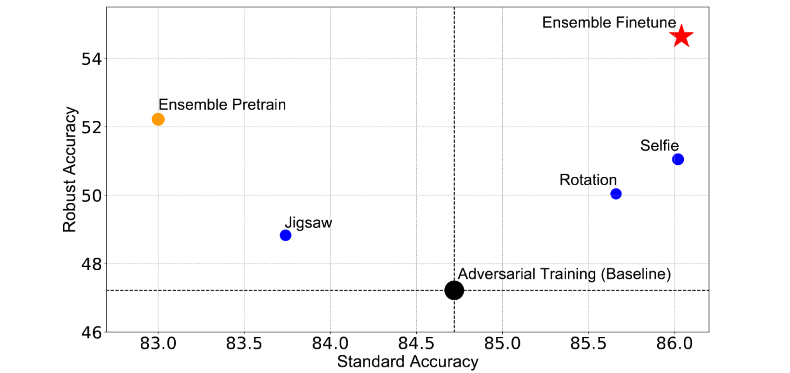
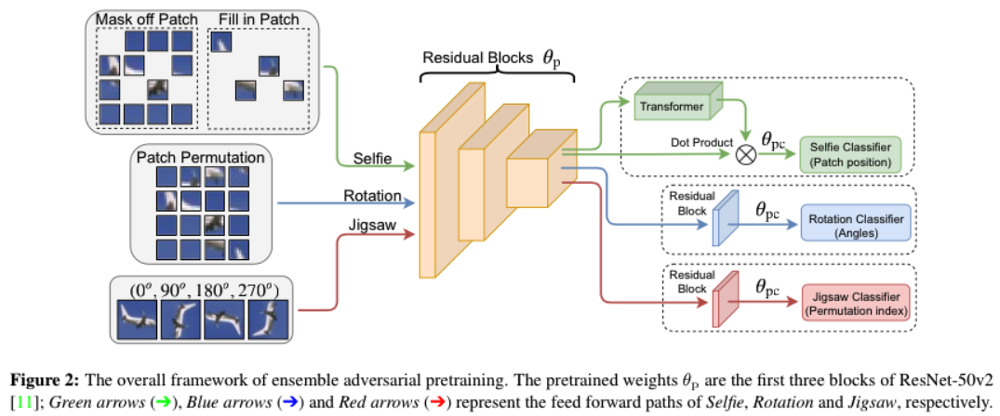

# Adversarial Robustness: From Self-Supervised Pre-Training to Fine-Tuning

[](https://opensource.org/licenses/MIT)

[Adversarial Robustness: From Self-Supervised Pre-Training to Fine-Tuning]()

Tianlong Chen, Sijia Liu, Shiyu Chang, Yu Cheng, Lisa Amini, and Zhangyang Wang

In CVPR 2020.

**[Trained Models](https://drive.google.com/drive/folders/18oY4mcK0qkcT5jzsRb-1A9R3Rzz5dEr8?usp=sharing) in Our Paper**. 

## Overview

Robust pretrained models can benefit the subsequent fine-tuning in two ways: **i) boosting final model robustness; ii) saving the computation cost, if proceeding towards adversarial fine-tuning.** Here we attach the summary of our achieved performace on CIFAR-10.



## Methods



## Training

Current this code base works for Python version >= 3.5, pytorch >= 1.2.0, torchvision >= 0.4.0

**Selfie pretraining:**

```shell
python train_adv_selfie.py --gpu 0 --data -b 128 --dataset cifar --modeldir save_cifar_selfie --lr 0.1
python train_std_selfie.py --gpu 0 --data -b 128 --dataset cifar --modeldir save_cifar_selfie --lr 0.1
```

**Rotation pretraining:**

```shell
python train_adv_rotation.py --gpu 1 --data -b 128 --save_dir adv_rotation_pretrain  --seed 22 
python train_std_rotation.py --gpu 1 --data -b 128 --save_dir adv_rotation_pretrain  --seed 22 
```

**Jigsaw pretraining :**

```shell
python train_adv_jigsaw.py --gpu 0 --data -b 128 --save_dir adv_jigsaw_pretrain --class_number 31 --seed 22 
python train_std_jigsaw.py --gpu 0 --data -b 128 --save_dir adv_jigsaw_pretrain --class_number 31 --seed 22 
```

**Ensemble pretrain with penalty:**

```shell
python -u ensemble_pretrain.py --gpu=1 --save_dir ensemble_pre_penalty --data ../../../ --batch_size 32
```

**Finetune:**

```shell
python main.py --data --batch_size --pretrained_model --save_dir --gpu
```

## Details of files

### Pre-training

- attack_algo.py: including the attack functions for jigsaw, rotation, selfie respectively
- attack_algo_ensemble.py: attack function of ensemble pre-training
- dataset.py: dataset for cifar & imagenet32
- ensemble_pretrain.py: main code of ensemble pretrain with penalty
- functions.py: functions for plotting
- model_ensemble.py: model for ensemble pre-training
- resenetv2.py: ResNet50v2
- train_adv_jigsaw.py: main code of  adversarial jigsaw pre-training
- train_adv_rotation.py: main code of adversarial rotation pre-training
- train_adv_selfie.py: main code of adversarial selfie pre-training
- train_std_jigsaw.py: main code of  standard jigsaw pre-training
- train_std_rotation.py: main code of standard rotation pre-training
- train_std_selfie.py: main code of standard selfie pre-training

### Fine-tuning:

- attack_algo.py: attack for finetune task
- main.py: adversarial training on cifar10
- model_ensemble.py: multi-branch model for fine-tuning
- resnetv2.py:  Resnet50v2

## Citation

If you are use this code for you research, please cite our paper.

```
@inproceedings{chenadversarial,
  title={Adversarial Robustness: From Self-Supervised Pre-Training to Fine-Tuning},
  author={Chen, Tianlong and Liu, Sijia and Chang, Shiyu and Cheng, Yu and Amini, Lisa and Wang, Zhangyang},
  booktitle={Proceedings of the IEEE Conference on Computer Vision and Pattern Recognition},
  year={2020}
}
```


